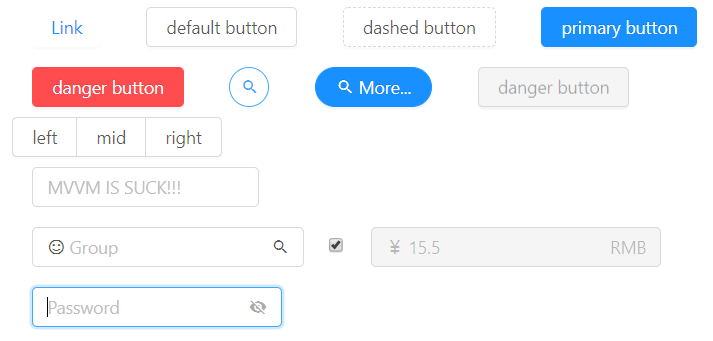

# HerbJs
🌿The whole HerbJs has a characteristic taste and odour.

# DON'T USE THIS IN PRODUCTION ENVIRONMENT
*现目前还有很多问题没解决

# Index
- [HerbJs](#herbjs)
- [DON'T USE THIS IN PRODUCTION ENVIRONMENT](#dont-use-this-in-production-environment)
- [Index](#index)
- [Background](#background)
- [Usage](#usage)
      - [SWR-like](#swr-like)
      - [拥抱函数式](#%e6%8b%a5%e6%8a%b1%e5%87%bd%e6%95%b0%e5%bc%8f)
      - [零编译依赖](#%e9%9b%b6%e7%bc%96%e8%af%91%e4%be%9d%e8%b5%96)
      - [Typescript](#typescript)
      - [diff](#diff)
      - [antd-like ui](#antd-like-ui)
      - [light-lib](#light-lib)
- [TODO](#todo)
- [License](#license)

# Background
```ts
const fn = ctx => html`...` 
```

简而言之，怎么写得爽就怎么来，所有性能问题都是伪需求


# Usage
#### SWR-like 
> 某些业务框架为了用SWR甚至可以推翻重构（重写）

<details>
<summary>Code</summary>

```ts
const fetcher = 
    (...args) => window
        .fetch(...args)
        .then(resp => resp.json());

const useSysApi = () => {
    const {
        resp: token,
        revalidate: tokenReqRetry
    } = useReq('/api/token?q=cpu,mem', fetcher, {
        dedupe: true
    })
    const {
        resp: sysinfo,
        error
    } = useReq(
        // 如果没有token，自动拦截后续请求，等待依赖满足请求
        () => `/api/sys?q=cpu,mem&token=${token.data.token}`, fetcher, {
            pollingInterval: 2000,
            dedupe: true,
        }
    )
    Effect(() => {
        if (sysinfo.data && sysinfo.data.error) {
            // error catch
            tokenReqRetry()
        }
    })
    return {
        token,
        sysinfo,
        error
    }
}

const SysInfo = () => {
    const {
        token,
        sysinfo,
        error
    } = useSysApi()
    return html `<pre>${JSON.stringify(sysinfo, null, '  ')}<pre>`
}
```

</details>

#### 拥抱函数式
> 😀 任何心智投入永远都是值得的。 ---- 鲁迅

<details>
<summary>Code</summary>

```ts
const panelBase = div1 => div2 => div3 => div4 => div5 => {
    const { 
        styleRef
    } = useStyle({
        ...css`
            display: grid;
            grid-template-columns: repeat(5, 1fr);
            grid-template-rows: repeat(5, 1fr);
            grid-column-gap: 0px;
            grid-row-gap: 0px;
        `,
        '.div1': css`grid-area: 1 / 1 / 2 / 2`,
        '.div2': css`grid-area: 1 / 5 / 2 / 6`,
        '.div5': css`grid-area: 5 / 1 / 6 / 2`,
        '.div3': css`grid-area: 5 / 1 / 6 / 3`,
        '.div4': css`grid-area: 5 / 4 / 6 / 6`,
    })
    return html`
    <div ref=${[styleRef]}>
        ${
            [div1,div2,div3,div4,div5]
            .map(
                (content, idx) =>
                    html`<div class=${`div${idx}`}>
                            ${content}
                        </div>`
                )
        }
    </div>
    `
}
const HomePanel = panelBase(backBtn)(optionBtn)(footerLeft)(footRight)
const UserPanel = panelBase(backBtn)(null)(footerLeft)(footRight)
const MsgPanel = panelBase(null)(null)(null)(null)
```

</details>

#### 零编译依赖
> NO LOADER

只要v8够强，性能问题就不可能追上我！

<details>
<summary>Code</summary>

```ts
import { html, css } from 'lib/core'
const CubeButtonStyle = (size = '2rem') => {
    return css`
        width: ${size};
        height: ${size};
        user-select: none;
        cursor: pointer;
        border: 2px solid #f5f6f8;
        padding: 1rem 0.5rem;
        border-radius: 1rem;
        display: flex;
        justify-content: center;
        align-items: center;
        font-size: 1rem;
        font-weight: 600;
    `
}
const LargeCubeButton = () => html`
    <div style=${CubeButtonStyle('10rem')}></div>
`
```

</details>


#### Typescript
> [TODO]
#### diff
> [TODO]
#### antd-like ui
> demo

<details>
<summary>Screenshot</summary>



</details>

#### light-lib

> useHashRouter

<details>
<summary>Code</summary>

```ts
const app = () => {
    // ...
    const appRouterViewer = useHashRouter({
        '/index': () => html `<h1>Index Page</h1>`,
        '/': () => html `<h1>Index Page</h1>`,
        '/users/:id/:page': ({
            params
        }) => html `<p>User: ${params.id}</p><p>${params.page} Page.</p>`
    })
    // ...
}
```

</details>

> [TODO]

# TODO
- 异步渲染
- 异步依赖
- html模板引擎重构 children frag cacher

# License
GPL-3.0
